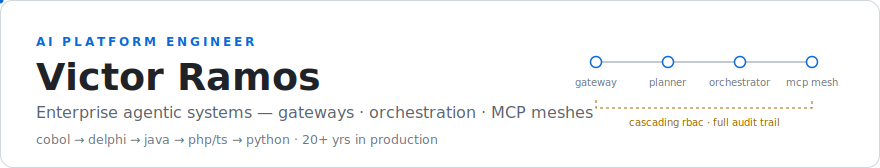
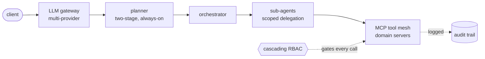

<picture>
  <source media="(prefers-color-scheme: dark)" srcset="./assets/banner-dark.svg">
  <source media="(prefers-color-scheme: light)" srcset="./assets/banner-light.svg">
  
</picture>

**Open to remote contract work (US/EU)** — based in Brazil, UTC−3, full US-Eastern overlap.
[victor.h.ramos.ai@gmail.com](mailto:victor.h.ramos.ai@gmail.com) · [victorhramos-dev.github.io](https://victorhramos-dev.github.io/) · [LinkedIn](https://www.linkedin.com/in/victor-henrique-ramos-5b3390113)

I design and ship **enterprise agentic systems** — the platform layer that lets an organization run LLM agents safely in production: multi-provider gateways, always-on planning, orchestrator → sub-agent delegation, and MCP tool meshes governed by real RBAC. Twenty-plus years shipping software — agents are my fifth platform, not my first.

**`now`** — open-sourcing the MCP mesh-authorization pattern as [`mcp-rbac-profile`](https://github.com/victorhramos-dev/mcp-rbac-profile) · writing about agent governance

### The system I keep building

The recurring shape of what I ship — the pattern, not any one product. The latest instance runs in production at enterprise scale; numbers below.

### Evidence

| System | What it is | Proof |
|:--|:--|:--|
| **Enterprise AI platform** private · a major Brazilian port authority | Multi-provider LLM gateway · always-on two-stage planner · orchestrator → sub-agent delegation · cascading permissions with a full audit trail | `9` domain MCP servers · `~138` tools · `270+` tests · PHPStan `level 8` · staged deploys |
| [**`mcp-rbac-profile`**](https://github.com/victorhramos-dev/mcp-rbac-profile) public · v0.1 released | Open spec + TypeScript reference implementation: RBAC-aware delegation for MCP server meshes | the governance layer above, generalized — spec-first: threat model, token format, three-server example mesh |

### Stack

`TypeScript / Node` `Python` `PHP 8 / Laravel` `React` `PostgreSQL` `Redis` `Qdrant` `Docker` `vLLM` `MCP SDK`

### Appendix

How the MCP mesh is governed — cascade, provenance, deny-as-data

The pattern, minus employer specifics — the spec version lives in [`mcp-rbac-profile`](https://github.com/victorhramos-dev/mcp-rbac-profile):

- **Grants cascade and only narrow.** Identity → role → agent → tool. When the orchestrator delegates, a sub-agent's effective grants are the intersection of its parent's grants and its own profile. No hop in the chain can mint new authority.
- **Every tool call carries provenance.** Which plan step requested it, which agent executed it, under which grant — the audit trail reconstructs prompt → plan → delegation → tool I/O, end to end.
- **Deny is data.** Refused calls are logged with the failing grant, so authorization gaps surface as reviewable events instead of silent agent failures.
- **Enforcement sits at the mesh boundary, not in prompts.** Agents can be wrong; the permission layer cannot be talked out of a decision.

Platform history — 20+ years, COBOL to agents

| Era | Platform | What shipping meant |
|:--|:--|:--|
| early 2000s | `COBOL` | Batch systems where a bad run ruined real ledgers. Correctness became a habit, not a phase. |
| mid 2000s | `Delphi` | Desktop line-of-business software for people at real counters. UX turned into a production concern. |
| late 2000s | `Java` | Enterprise backends. Architecture is whatever survives the team that wrote it. |
| 2010s | `PHP · TypeScript` | The long middle: web platforms, APIs, CI discipline, shipping weekly for years. |
| 2020s → now | `Python` + all of the above | AI platform work — gateways, planners, agent meshes. New platform, same job: make it hold in production. |

Four full platform migrations shipped in production. Fundamentals transferred every time; ceremony never did.

---

**Hiring for agentic platform work?** I take remote contract engagements (US/EU). Based in Brazil — `UTC-3`, full overlap with US Eastern.

[victor.h.ramos.ai@gmail.com](mailto:victor.h.ramos.ai@gmail.com) · [victorhramos-dev.github.io](https://victorhramos-dev.github.io/) · [linkedin/victor-henrique-ramos](https://www.linkedin.com/in/victor-henrique-ramos-5b3390113)
